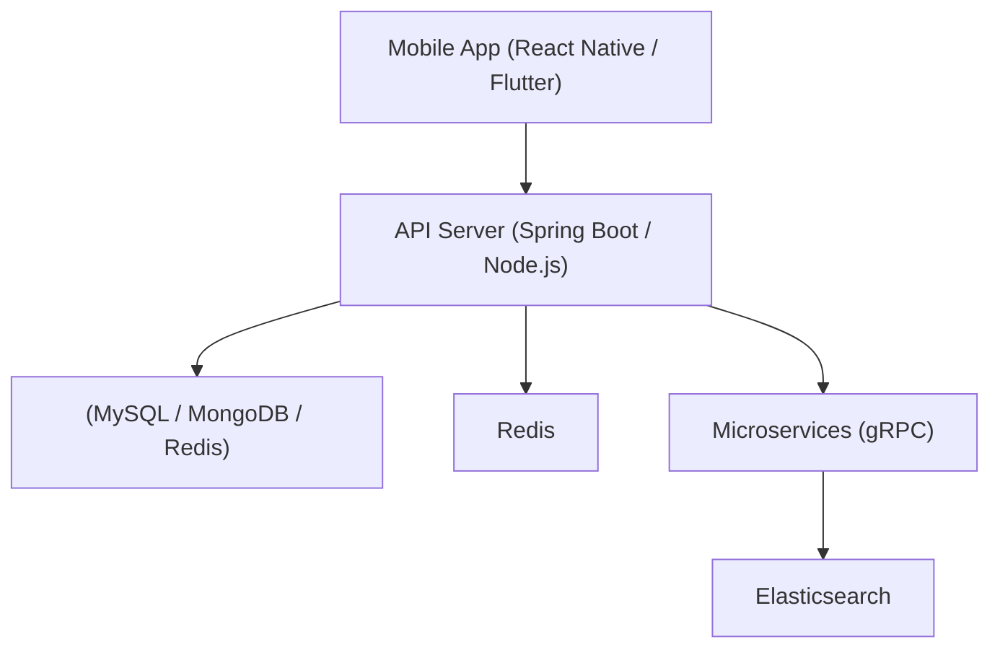

# 🔒 Some parts of this repo are private.

👋 Want to take a look? Just 
- 💻 [Slack Workspace](https://drag-on-fly.slack.com/archives/C098V59SRPY)
- 🎧 [Join the Discord Server](https://discord.gg/7RQHWuhj)
and I’ll get back to you!  
# 🧑‍💻 Project Showcase: Beginner-Friendly Examples

Welcome to this repository — a curated collection of beginner-friendly examples and reference implementations.  
Whether you're just beginning your development journey or exploring real-world project structures, this repository provides practical, understandable patterns that aim to accelerate your learning.

## 📚 What's Included

This collection showcases simplified examples across various tech stacks, including:

- ☕ **Spring Boot**, 🧬 **gRPC**, 🔧 **Thymeleaf**
- 🟨 **Node.js**, ⚛️ **React Native**, 🎯 **Flutter**
- 🐍 **Python**, 🐹 **Go**
- 🐬 **MySQL**, 🟥 **Redis**, 🍃 **MongoDB**
- 🐳 **Docker Compose**, 📡 **Elasticsearch**

Each example is designed with clarity and structure in mind, making it easier to understand core concepts such as:

- Backend API development
- Frontend rendering with templating engines or native UIs
- Database interactions
- Asynchronous communication
- Containerization and orchestration
- Scalable application architecture

---

## 📊 Architecture Diagram

---

## 📸 Example Screenshots

### React Native

### Spring Boot REST API

---

## 🤝 Contributing

If you find any mistakes, have improvement ideas, or wish to contribute beginner-friendly examples of your own, feel free to submit a pull request or open an issue.

---

## 📬 Contact

For other inquiries, suggestions, or collaboration, please reach out via [GitHub Issues](https://github.com/your-username/your-repo-name/issues).

## Skills
#### I use it often.

  
  
  
    
  
  
  

#### I've used it before.

  
  
  
  
  
  
  
  
  
  
  
  
  
  
  
  
  
  
  
  
   
   
   

 
 
 

Copyright ⓒ
